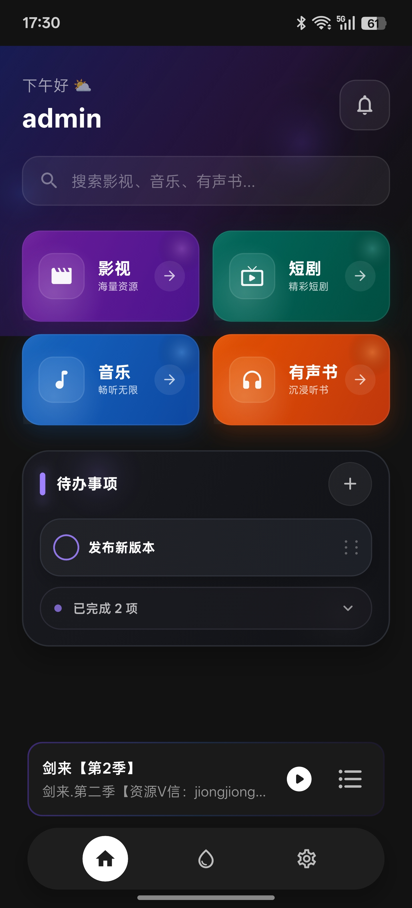
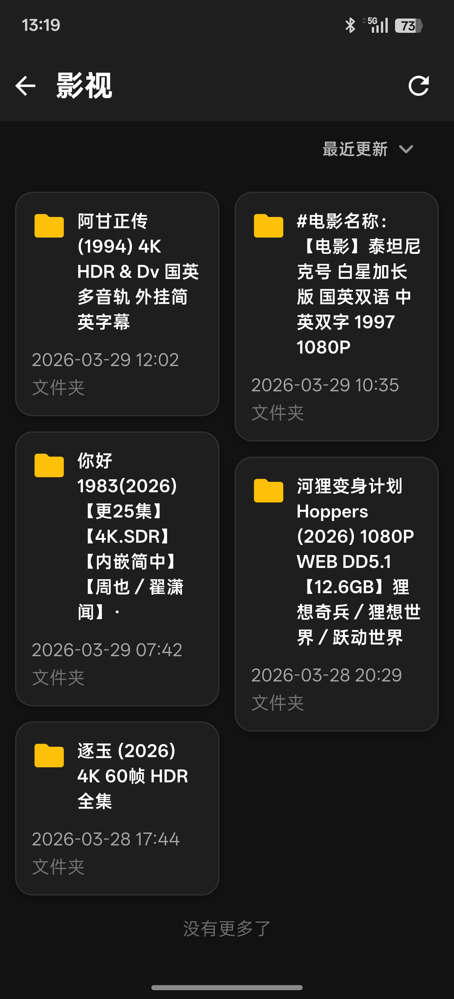
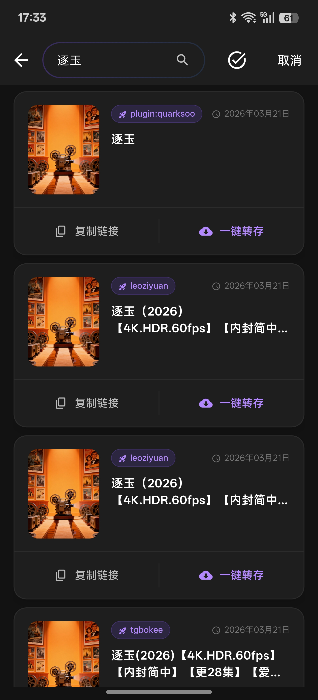
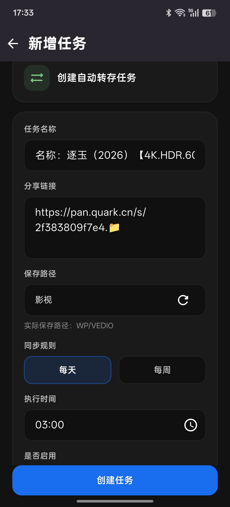
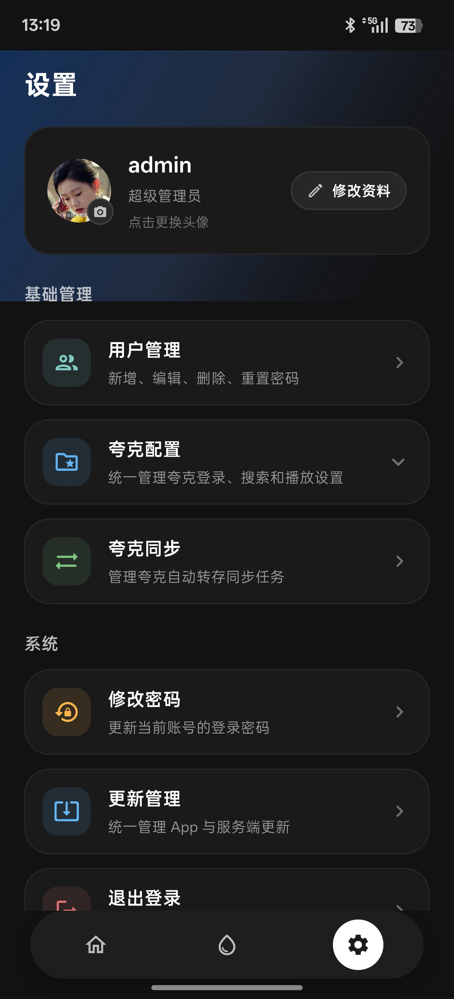
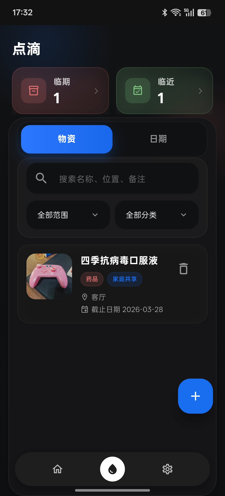
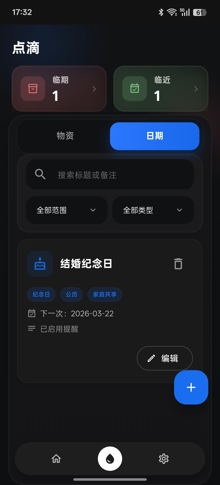
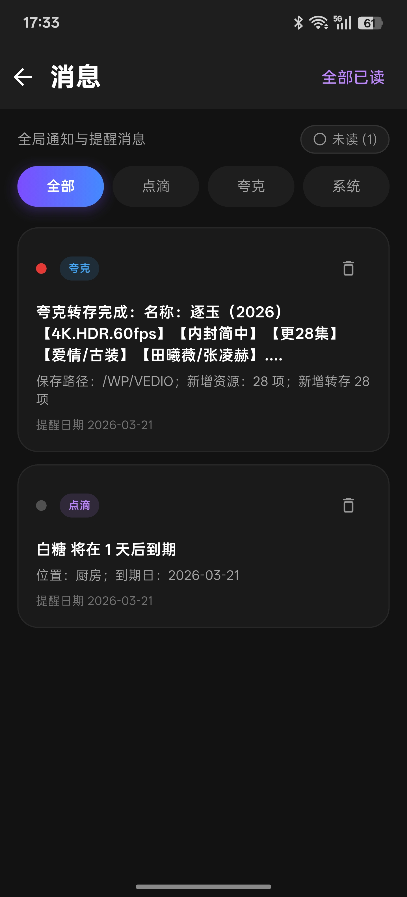

# ohome

`ohome` 是一个面向家庭场景的个人/家庭资源管理项目，分为两个部分：

- `end/`：Go + Gin 服务端，负责 API、数据存储、局域网发现和业务处理
- `app/`：Flutter 客户端，负责家庭影音、网盘和家庭事务等功能入口

## 功能概览

### 家庭影音资源中心

- 影视、短剧、音乐、有声书等资源入口
- 媒体播放与播放历史记录
- 最近观看记录回显
- 基于夸克网盘文件流的在线播放

### 夸克网盘能力

- 夸克登录配置
- 夸克目录配置管理
- 网盘文件浏览、重命名、移动、上传、删除、流式播放
- 夸克资源搜索
- 自动转存/同步任务
- 转存任务列表管理

### 家庭事务管理

- 待办事项管理
- “点滴”物资管理
- 物资临期提醒
- 重要日期提醒
- 站内消息与提醒中心

### 系统能力

- 用户登录、JWT 鉴权、刷新 token
- 用户管理、头像上传、密码修改/重置
- 局域网发现能力（HTTP + mDNS）

## 快速上手

1. 先启动服务端
2. 再安装 Android 客户端
3. 在客户端登录页通过局域网发现或手动输入服务端地址完成连接

## 仓库结构

```text
.
├── .github/workflows/    # GitHub Actions
├── app/                  # Flutter 客户端
│   ├── assets/env/       # dev/prod 环境配置
│   └── build_prod.sh     # Android 一键打包脚本
├── end/                  # Go 后端
│   ├── conf/             # 配置文件
│   ├── data/             # SQLite 数据库、实例数据
│   ├── log/              # 日志目录
│   ├── router/           # 路由定义
│   ├── service/          # 业务逻辑
│   ├── sql/              # 初始化 SQL
│   ├── Dockerfile        # 后端镜像构建文件
│   └── docker-compose.yml # 本地构建用 compose
└── scripts/              # 仓库辅助脚本
```

## 服务端

#### 快速启动（docker run）

```bash
mkdir -p /opt/ohome/conf /opt/ohome/data /opt/ohome/log 

docker run -d --name ohome-server --restart unless-stopped -p 18090:18090 -v /opt/ohome/conf:/app/conf -v /opt/ohome/data:/app/data -v /opt/ohome/log:/app/log hanlinwang0606/ohome:runtime-v2026.03.1
```

### 服务端配置说明

主配置文件是 [`end/conf/config.yaml`](./end/conf/config.yaml)，默认关键配置如下：

- `server.port`：服务端口，默认 `18090`
- `DB.driver`：默认 `sqlite`
- `DB.dsn`：默认 `./data/ohome.db`
- `DB.AutoMigrate`：自动建表
- `DB.InitData`：启动时导入初始化数据
- `jwt.signKey`：JWT 签名密钥
- `config.defaultPassword`：重置密码后的默认密码
- `drops.itemReminderDays` / `drops.eventReminderDays`：提醒提前天数
- `update.manifestUrl`：服务端滚动更新清单地址
- `update.updater.baseUrl`：服务端访问本机 launcher 控制面的地址，默认 `http://127.0.0.1:18091`


### 服务端数据持久化

服务端部署时，下面几个目录最重要：

- [`/opt/ohome/conf/config.yaml`](./end/conf/config.yaml)：运行配置
- [`/opt/ohome/data`](./end/data)：数据库和实例标识
- [`/opt/ohome/log`](./end/log)：日志文件

建议定期备份

## 客户端

### 客户端适合做什么

客户端是 Flutter 应用，当前主要面向 Android 使用，负责登录、资源浏览、播放、网盘管理、待办和提醒等交互能力。

### 客户端界面预览

#### 首页与资源能力

<table>
  <tr>
    <td align="center">
      
      <br />
      首页
    </td>
    <td align="center">
      
      <br />
      资源管理
    </td>
    <td align="center">
      
      <br />
      夸克资源全网搜索
    </td>
  </tr>
  <tr>
    <td align="center">
      
      <br />
      转存任务
    </td>
    <td align="center">
      
      <br />
      设置界面
    </td>
    <td></td>
  </tr>
</table>

#### 播放体验

<table>
  <tr>
    <td align="center">
      
      <br />
      短剧播放
    </td>
    <td align="center">
      
      <br />
      影视播放可全屏
    </td>
    <td align="center">
      
      <br />
      音乐播放
    </td>
  </tr>
  <tr>
    <td align="center">
      
      <br />
      有声书播放
    </td>
    <td></td>
    <td></td>
  </tr>
</table>

#### 家庭事务与提醒

<table>
  <tr>
    <td align="center">
      
      <br />
      物资管理
    </td>
    <td align="center">
      
      <br />
      重要日期提醒
    </td>
    <td align="center">
      
      <br />
      消息中心提醒
    </td>
  </tr>
</table>

### 客户端如何连接服务端

客户端和服务端配合使用，推荐连接顺序如下：

1. 先确认服务端已经启动
2. 手机和服务端尽量处于同一局域网
3. 在客户端登录页优先使用局域网发现
4. 如果自动发现失败，手动输入服务端地址，例如 `http://192.168.1.10:18090`

## 参考项目

本项目在设计和实现过程中参考了以下开源项目：

- [fish2018/pansou](https://github.com/fish2018/pansou)
- [OpenListTeam/OpenList](https://github.com/OpenListTeam/OpenList)
- [Cp0204/quark-auto-save](https://github.com/Cp0204/quark-auto-save)

## 免责声明

本项目为个人兴趣开发，旨在通过程序自动化提高网盘使用效率。

程序没有任何破解行为，只是对于夸克已有的 API 进行封装，所有数据来自于夸克官方 API；本人不对网盘内容负责，不对夸克官方 API 未来可能的变动导致的影响负责，请自行斟酌使用。

源码公开仅供学习与交流使用，未授权商业使用，严禁用于非法用途。
